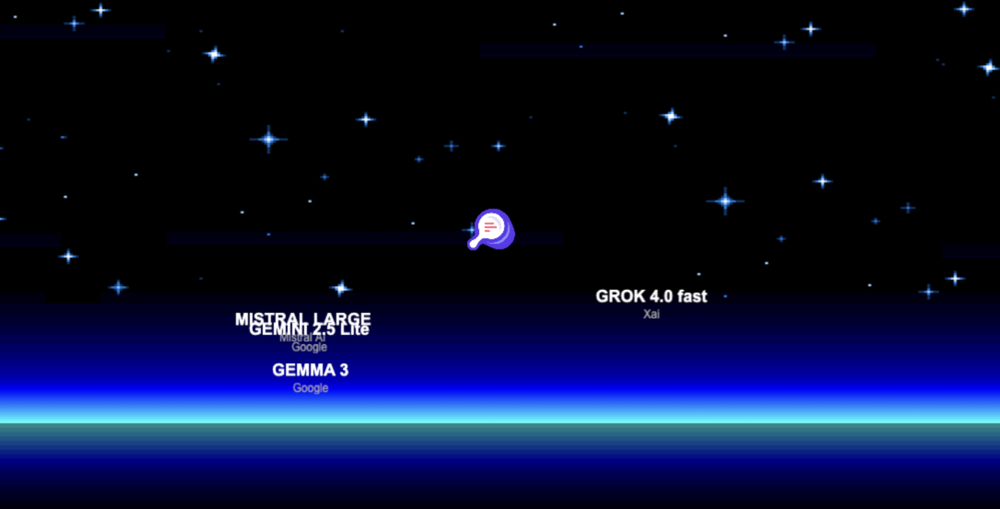

# LLM (real) Arena 🤖⚔️

**Version:** 0.3

Welcome to **LLM (real) Arena**, a chaotic arcade game where you must pop the AI bubble before it bursts on its own!

## 📸 Screenshots

| Title Screen | Gameplay |
|:---:|:---:|
|  |  |

## 🎮 Gameplay
You are the **Search Foundry** agent (the Clone), floating in the digital void.
Your mission: **Pop the AI Bubble**.

- **The Bubble**: A finite set of unique AI models (displaying **Model Name** & **Company**) spawn in waves.
- **Spawn Timer**: A visual timer bar indicates when the next wave of AI models will arrive.
- **Potential (TTL)**: Each model has a "Potential" score that decreases over time (1000 points/sec).
- **Bubble Burst**: If a model's potential reaches zero, it self-destructs (the bubble bursts), and you lose those points.
- **Scoring**: Click on enemies to destroy them and "capture" their remaining potential as your score.
- **Win Condition**: Destroy all models to clear the arena and see your total score and time.
- **Physics**: Realistic bouncing, zero-gravity mechanics, and a **Central Obstacle** that deflects objects.

## 🕹️ Controls
- **Arrow Keys**: Move the Clone (Agent)
- **Mouse Click**: Destroy Enemy
- **Volume Slider**: Adjust Music Volume

## 🚀 Installation & Development

1.  **Clone the repository:**
    ```bash
    git clone git@github.com:Search-Foundry/llm-real-arena.git
    cd llm-real-arena
    ```

2.  **Install dependencies:**
    ```bash
    npm install
    ```

3.  **Run local server:**
    ```bash
    npm run dev
    ```
    Open `http://localhost:5173/` in your browser.

4.  **Build for production:**
    ```bash
    npm run build
    ```
    The output will be in the `dist` folder.

## 🛠️ Technologies
- **Phaser 3**: Game Framework
- **Vite**: Build Tool
- **JavaScript**: Logic

## 📝 Credits
- Developed by **Antigravity**  & **GarethJax** (https://github.com/garethjax)
- **tutta la responsabilità di questa cagata è di Andrea Scarpetta (https://www.andreascarpetta.it)**
- Music: "Defeat the Circuit Lords" by SUNO.AI
- Assets: Phaser Labs & Custom music by freesounds.org
- Supporto involontario di Search foundry: https://www.searchfoundry.pro

---
*Non vi aspettate nulla di particolare, è solo un sano momento di follia*
